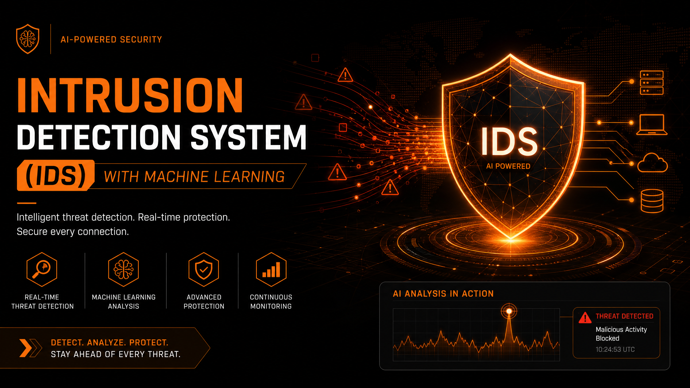

# 🛡️ IDS Machine Learning — Sistema de Detecção de Intrusão com Aprendizagem Automática

## Visão Geral

O **IDS Machine Learning** é um sistema avançado de deteção de intrusão que utiliza modelos de aprendizagem automática para analisar o tráfego de rede e identificar comportamentos maliciosos em tempo real. Projetado para proteger infraestruturas digitais contra ameaças cibernéticas cada vez mais sofisticadas, esta solução oferece uma camada robusta de segurança proativa.

Ao combinar a monitorização contínua de pacotes com algoritmos inteligentes, o IDS Machine Learning é capaz de detetar padrões de intrusão conhecidos e anomalias emergentes, garantindo a integridade e a confidencialidade dos seus dados.

## ✨ Funcionalidades Chave

*   **Captura de Pacotes em Tempo Real:** Monitorização ativa e contínua da interface de rede para recolha de dados de tráfego.
*   **Deteção Inteligente de Ataques:** Utiliza algoritmos de Machine Learning para identificar padrões de intrusão conhecidos (assinaturas) e comportamentos anómalos que podem indicar novas ameaças.
*   **Análise Comportamental:** Capacidade de aprender e adaptar-se ao comportamento normal da rede, minimizando falsos positivos e otimizando a deteção de ameaças reais.
*   **Visualização Abrangente:** Geração de gráficos e relatórios detalhados sobre a saúde da rede, ameaças detetadas, tipos de tráfego e portas mais visadas, facilitando a compreensão e a resposta a incidentes.
*   **Modularidade e Escalabilidade:** Arquitetura flexível que permite a integração de novos modelos de ML e a adaptação a diferentes ambientes de rede.

## 🚀 Benefícios para a Segurança da Rede

*   **Proteção Proativa:** Identifica e alerta sobre ameaças antes que causem danos significativos.
*   **Redução de Riscos:** Minimiza a exposição a ataques cibernéticos, protegendo dados sensíveis e sistemas críticos.
*   **Eficiência Operacional:** Automatiza a deteção de ameaças, libertando equipas de segurança para tarefas mais estratégicas.
*   **Insights Acionáveis:** Fornece informações claras e detalhadas para uma resposta rápida e eficaz a incidentes de segurança.
*   **Conformidade:** Ajuda a cumprir regulamentações de segurança de dados através de monitorização e relatórios contínuos.

## 🛠️ Tecnologias

Desenvolvido com tecnologias de ponta para garantir desempenho e precisão:

*   **Linguagem:** Python (para flexibilidade e acesso a um vasto ecossistema de bibliotecas de ML).
*   **Machine Learning:** Scikit-learn / TensorFlow (para construção e otimização de modelos de deteção).
*   **Análise de Rede:** Scapy + Pandas (para captura, manipulação e análise eficiente de pacotes de rede).

## 🤝 Contribuição

Convidamos a comunidade de segurança cibernética e entusiastas de Machine Learning a contribuir para este projeto. Se tiver ideias, melhorias ou desejar colaborar, sinta-se à vontade para abrir uma issue ou enviar um pull request.

## 📝 Licença

Este projeto está licenciado sob a Licença MIT - consulte o arquivo `LICENSE` para detalhes.

**Construído com ❤️ para uma Internet mais Segura.**
*Defendendo o seu mundo digital com inteligência artificial.*
